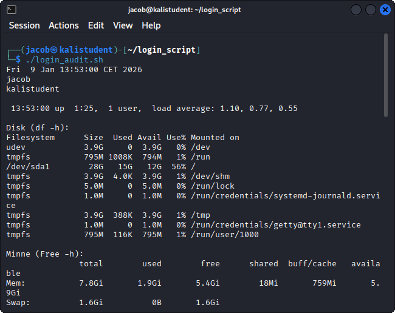
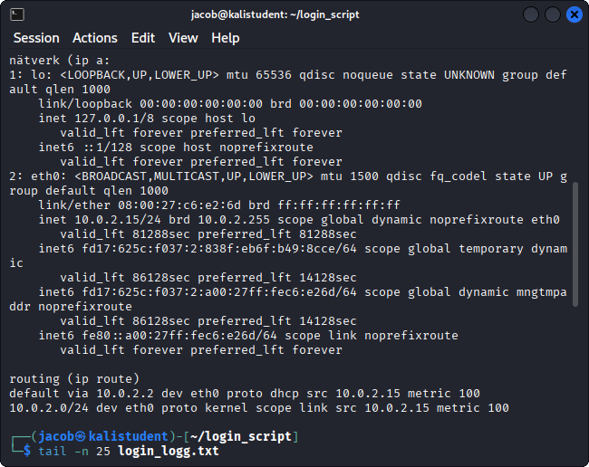

# inloggscript (nätverk & system)

# Syfte
Syftet med detta projekt är att skapa ett enkelt Bash-script som samlar in system och nätverksinformation och sparar den i en loggfil, vilket är användbart för överblick, felsökning och jämförelse över tid.


# vad scriptet gör
Scriptet loggar följande information:
- Datum och tid
- Inloggad användare
- Datornamn (hostname)
- Uptime
- Diskanvändning (df -h)
- Minnesanvändning (free -h)
- Nätverksinformation (ip a)
- Routing / default gateway (ip route)

All information skrivs både till terminalen och till en loggfil.


# systemkrav:
- Linux-baserat operativsystem
- Bash
- Följande kommandon tillgängliga: date, whoami, hostname, uptime, df, free, ip, tee


## Skärmdumpar / Demo


Nedan visas skärmdumpar från när scriptet körs.

### Exempel 1 – Script i körning


### Exempel 2 – Script i körning



# hur man kör:
1. gå till mappen
 ```bash
cd ~/login_script

2. kör scriptet
./login_audit.sh

3. loggfilen heter 
login_logg.txt

4. läsa loggfilen:
cat_login_log.txt


